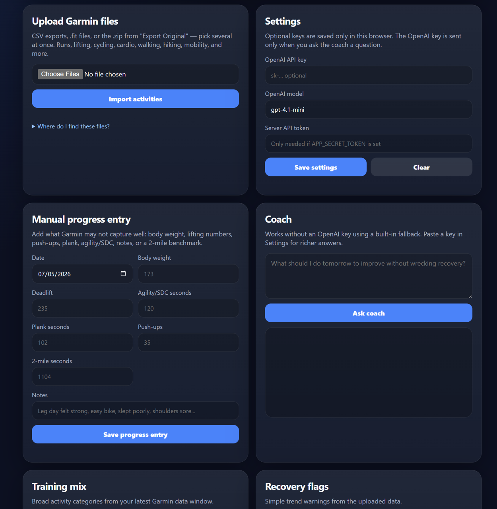
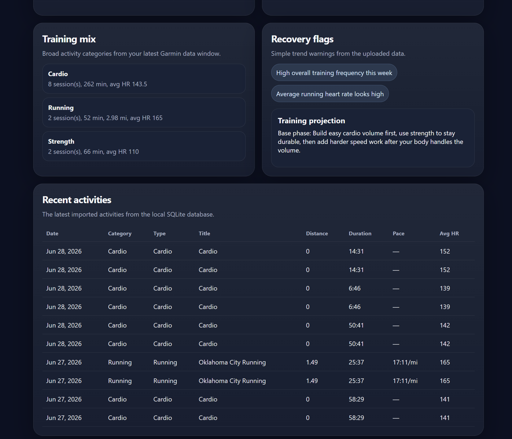

# Garmin Progress Coach

Privacy-first Garmin training dashboard with CSV import, progress tracking, recovery flags, and optional AI coaching.

Garmin Progress Coach is a small local web app that turns Garmin Connect activity exports into clear training summaries. It is built for people who want to improve without building a giant fitness platform first: upload a CSV, see your latest training mix, log a few manual progress numbers, and ask the built-in coach what to do next.

It works for general fitness first: running, lifting, cardio, walking, hiking, mobility, body-weight notes, and optional ACFT-style benchmarks.

## Why this project exists

Garmin Connect has a lot of data, but it is not always easy to answer simple questions like:

- Am I training consistently?
- Am I doing too much hard cardio and not enough recovery?
- Am I only running and ignoring strength?
- What should my next few workouts look like?
- How is my 2-mile progress looking if I care about that?

This app gives you a local-first starting point for those answers.

## Screenshots

Screenshots use demo training data.





## Features

- **Very easy setup**: one Python app, no Node, no React build, no Docker required.
- **Garmin CSV, FIT, and ZIP import**: bulk CSV exports, single-activity .fit files, and the .zip from "Export Original" — several files at once, with duplicates across formats merged into one activity.
- **Training mix summary**: groups activities into running, strength, cycling, cardio, walking/hiking, mobility, swimming, and other.
- **Manual progress logging**: body weight, lifting numbers, push-ups, plank, agility/SDC, 2-mile benchmark, and notes.
- **Built-in coach**: works without an OpenAI key using simple rule-based guidance.
- **Optional OpenAI coaching from the web UI**: paste an OpenAI API key in Settings for richer answers.
- **Optional API token from the web UI**: paste your local server token in Settings if you protect the API with `APP_SECRET_TOKEN`.
- **Local SQLite storage**: your data stays on your machine by default.
- **Mobile-friendly PWA**: open it on your phone over Wi-Fi or add it to your home screen.
- **Tests included**: parser, summary logic, and API route tests.

> 2-mile and ACFT-related outputs are unofficial training estimates only. This app is not an official Army score calculator.

## Quick start

You need Python 3.10 or newer.

### macOS / Linux

```bash
./start.sh
```

### Windows

```bat
start.bat
```

Then open:

```text
http://localhost:8000
```

Upload the sample file to try it immediately:

```text
sample-data/garmin_activities_sample.csv
```

The start script creates a virtual environment, installs dependencies, creates `.env` from `.env.example`, initializes SQLite, and starts the server. Running it again is safe.

## Manual setup

```bash
python3 -m venv .venv
source .venv/bin/activate        # Windows: .venv\Scripts\activate
pip install -r requirements.txt
cp .env.example .env             # Windows: copy .env.example .env
uvicorn app.main:app --reload
```

Open `http://localhost:8000`.

## Import Garmin data

1. Open Garmin Connect in your browser.
2. Go to **Activities** → **All Activities**.
3. Scroll until the activities you want are loaded.
4. Export as CSV.
5. Upload the CSV in the app.

The parser supports comma, semicolon, and tab delimiters, missing values like `--`, European decimal commas, pace in min/mile or min/km, and duplicate-safe re-uploads.

Upload limits are intentionally conservative for local safety: individual CSV/FIT files are capped at 25 MB, while ZIP uploads are capped at 200 MB and still go through FIT member-count, per-member, and decompressed-size guards.

## Use the app on your phone

For privacy, the app binds to `127.0.0.1` by default, meaning only your computer can open it.

To access it from your phone on the same Wi-Fi:

```bash
./start.sh --lan        # Windows: start.bat --lan
```

Find your computer's local IP, then open this on your phone:

```text
http://YOUR_LOCAL_IP:8000
```

On macOS, you can usually find the IP with:

```bash
ipconfig getifaddr en0
```

## Optional OpenAI coaching

The Coach page works without OpenAI. It uses a built-in fallback coach that looks at your sessions, minutes, training mix, runs, lifting, cardio, and recovery flags.

For richer coaching, open **Settings** in the web app and paste your OpenAI API key. The app sends the key only when you ask the coach a question. The server does **not** save that key to SQLite.

You can also set a server-side key in `.env`:

```bash
OPENAI_API_KEY=
OPENAI_MODEL=gpt-4.1-mini
```

Restart the app after editing `.env`.

Privacy note: by default, the app sends summarized training data to OpenAI, not raw GPS tracks or per-second heart-rate data. With no OpenAI key, nothing leaves your machine.

## Optional API protection

For normal local use, leave this blank in `.env`:

```bash
APP_SECRET_TOKEN=
```

If you expose the app beyond your machine, generate a long random token:

```bash
python -c "import secrets; print(secrets.token_urlsafe(32))"
```

Paste that value after `APP_SECRET_TOKEN=` in `.env`, restart the app, then paste the same token into **Settings** → **Server API token** in the web app. The dashboard will attach:

```text
Authorization: Bearer <token>
```

This makes the protected API usable from the web interface without requiring curl/Postman.

## Getting files out of Garmin

- **CSV (many activities at once):** Garmin Connect → Activities → All Activities → Export CSV (top right).
- **FIT (one activity, richer data):** open an activity → gear icon → Export Original. Upload the downloaded .zip as-is — no need to unzip it.
- **Straight from a watch:** plug it in over USB and copy files from `GARMIN/Activity/`. You can select many at once; non-activity files (daily monitoring data) are skipped automatically.

If the same workout arrives from both a CSV export and a FIT file, the app recognizes it and merges them into one activity, keeping the best of both (the CSV's title, the FIT file's precise timestamp and heart-rate fields).

## API endpoints

```text
GET  /api/summary/latest         latest training summary, mix, recovery flags, running marker
GET  /api/activities             imported activities
GET  /api/activities?category=strength
GET  /api/runs/recent            runs only
GET  /api/training/projection    general training projection + flags
POST /api/upload/garmin          import Garmin files (CSV, .fit, or .zip; multiple at once)
POST /api/upload/garmin-csv      legacy single-CSV import
POST /api/progress/entry         log manual progress numbers
POST /api/progress/settings      set your 2-mile goal
POST /api/coach/ask              ask the coach a question
GET  /openapi.json               schema for Custom GPT Actions
```

Legacy ACFT endpoints are still available for compatibility:

```text
GET  /api/acft/projection
POST /api/acft/entry
POST /api/acft/settings
```

Interactive API docs are available at:

```text
http://localhost:8000/docs
```

## Run tests

```bash
source .venv/bin/activate        # Windows: .venv\Scripts\activate
pytest
```

The tests use a throwaway temp database. They do not touch your local app data.

## Privacy and security

This repo is designed to be safe to publish and easy to audit:

- Real `.env` files are gitignored.
- SQLite databases are gitignored.
- Raw Garmin files like `.fit`, `.tcx`, and `.gpx` are gitignored.
- OpenAI keys typed into the web UI are saved only in browser localStorage and sent only with coach requests.
- Activity table cells render with `textContent`, not `innerHTML`, to avoid stored XSS from malicious CSV titles.
- Optional bearer-token checks use constant-time comparison.
- The app binds to localhost by default; LAN access requires `--lan`.

Before pushing to GitHub, run:

```bash
find . -type f | grep -Ei '(\.env$|\.sqlite3$|\.db$|\.fit$|\.tcx$|\.gpx$|\.log$|\.pyc$|__pycache__)'
grep -RInE 'sk-[A-Za-z0-9_-]{20,}|OPENAI[_]API_KEY=[A-Za-z0-9_-]+|APP[_]SECRET[_]TOKEN=[A-Za-z0-9_-]+|BEGIN (RSA|OPENSSH|PRIVATE)' . --exclude-dir=.git --exclude='*.png'
```

Expected result: no real secrets, no local databases, no raw personal Garmin files, and no generated cache files.

## Project structure

```text
garmin-progress-coach/
  app/
    main.py            FastAPI app + static file serving
    database.py        SQLite schema and queries
    security.py        optional bearer-token check
    routes/            upload, summary, progress/ACFT, coach endpoints
    services/          Garmin CSV/FIT parsers, categorization, summary builder
    static/            plain HTML/CSS/JS dashboard (PWA)
  sample-data/         fake sample CSV to try immediately
  tests/               pytest suite
  docs/                Custom GPT Action guide and README screenshots
```

## Roadmap

The best next features are deliberately small and useful:

1. **TCX/GPX import** to cover the remaining export formats (FIT is done).
2. **Simple trend charts** for weekly minutes, running pace, and strength/body-weight notes.
3. **Goal modes** for general fitness, running improvement, strength, weight loss, ACFT, or custom.
4. **Weekly markdown export** for copying a training review into notes or ChatGPT.
5. **Official ACFT scoring** only if the official tables are implemented and cited.

## Custom GPT Action

See [docs/custom_gpt_action.md](docs/custom_gpt_action.md) if you want a Custom GPT to call this app's API.

## License

MIT. See [LICENSE](LICENSE).
